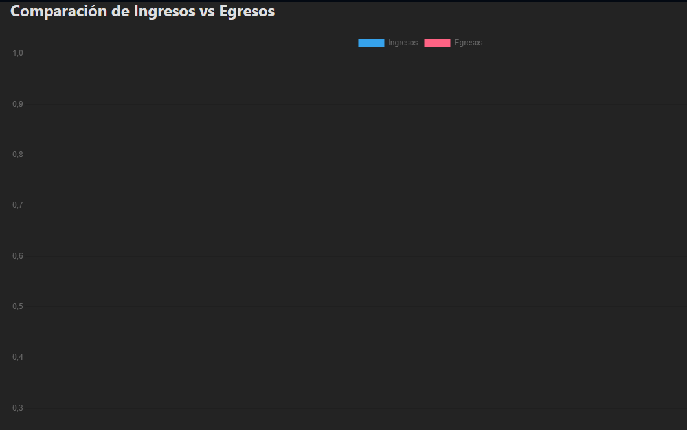
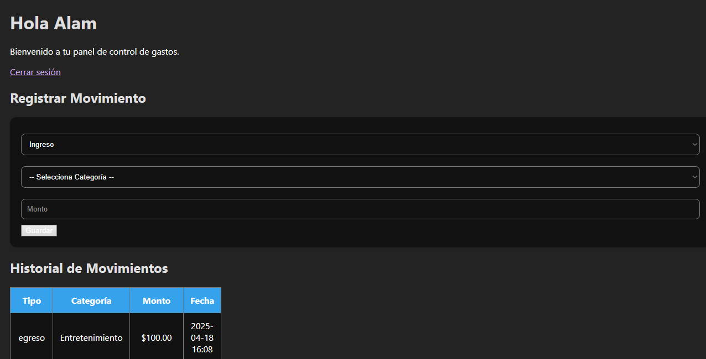
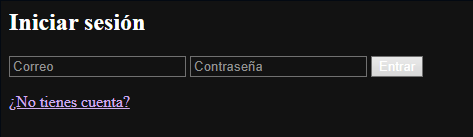
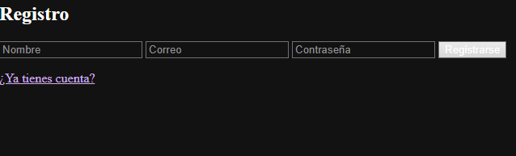

# 📊 Plataforma de Seguimiento de Gastos Personales

Este proyecto es una aplicación web desarrollada con **Flask**, **MySQL** y **HTML/CSS/JS** que permite a los usuarios registrar y visualizar sus ingresos y egresos de manera organizada.

## 🚀 Características

- Registro de ingresos y egresos
- Categorización por tipo
- Visualización de estadísticas con gráficos
- Registro y autenticación de usuarios
- Interfaz simple y clara

## 🛠 Tecnologías usadas

- Python + Flask
- MySQL (usando SQL Workbench)
- HTML, CSS, JavaScript
- Chart.js para visualizaciones
- Bootstrap (si aplicaste estilo)
- Flask-Login para autenticación

## 📸 Capturas

### Dashboard principal







## ⚙️ Instalación y ejecución

1. Clona el repositorio:
```bash
git clone https://github.com/AlamBax/seguimiento_gastos